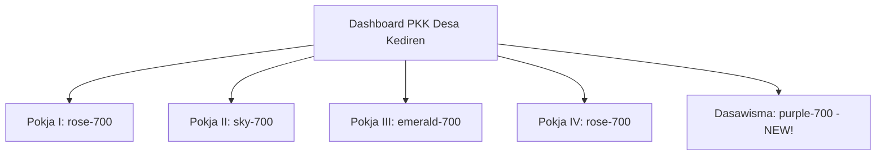

# Gerakan Kelompok Dasawisma Digital - TP PKK Desa Kediren

> **STATUS FITUR:** 🚀 **100% DEPLOYED & STABIL**
> Modul khusus Dasa Wisma sebagai ujung tombak gerakan TP PKK Desa Kediren kini telah resmi terpasang secara mandiri, lengkap dengan rekapitulasi data KK, gizi, sanitasi sehat, dan log kegiatan gotong-royong.

---

## 📅 Rangkuman Implementasi Dasawisma

### 1. Pembangunan Halaman Khusus (`src/app/admin/pkk/dasawisma/page.tsx`)
*   **Warna Tema Premium**: Menggunakan gradasi ungu-fuchsia (`from-purple-700 to-fuchsia-850`) untuk melambangkan kebersamaan, kesehatan, dan soliditas gerakan Dasawisma.
*   **3 Buku Administrasi Tab**:
    1.  **Buku 1: Kelompok Dasawisma (Buku Induk)**: Menampilkan rekap 12 kelompok Dasawisma (Mawar, Melati, Anggrek, Bougenville, dsb.) lengkap dengan indikator sanitasi (jamban sehat, air bersih, pengolahan sampah) dan keaktifan kebun gizi organik.
    2.  **Buku 2: Catatan Pantauan Keluarga**: Pendataan real-time kondisi gizi per Kepala Keluarga, jumlah balita stunting, lansia, ibu hamil, dan status ketahanan pangan mandiri.
    3.  **Buku 3: Log Gotong Royong (Buku Aksi)**: Pencatatan dokumentasi arisan sehat, kerja bakti kebun gizi, pemanfaatan pekarangan (Hatinya PKK), dan pilah sampah mandiri.

### 2. Penghubung Dashboard Utama (`src/app/admin/pkk/PkkDashboard.tsx`)
*   Mengarahkan aksi tombol Card Dasa Wisma di dashboard utama dari yang semula hanya filter pencarian log umum ke halaman dasawisma khusus (`/admin/pkk/dasawisma`).

### 3. Data Storage & Sinkronisasi
*   Dilengkapi dengan penyimpanan lokal interaktif (`localStorage`) sehingga data penambahan kelompok, keluarga binaan, dan log kegiatan langsung tersimpan instan dan aman di peramban pengguna.

---

## 🛠️ Status Sinkronisasi Skema Database (Sukses!)
*   ✅ **`npx prisma db push`**: **Sukses** (0 error, struktur MySQL Desa Kediren sinkron 100%).
*   ✅ **`npx prisma generate`**: **Sukses** (compiler client Prisma tergenerasi dengan sukses).

---

## 🖼️ Tampilan Baru Dashboard PKK

Modul digitalisasi PKK Juara II Kabupaten Magetan ini sekarang telah lengkap seutuhnya untuk seluruh lini!
